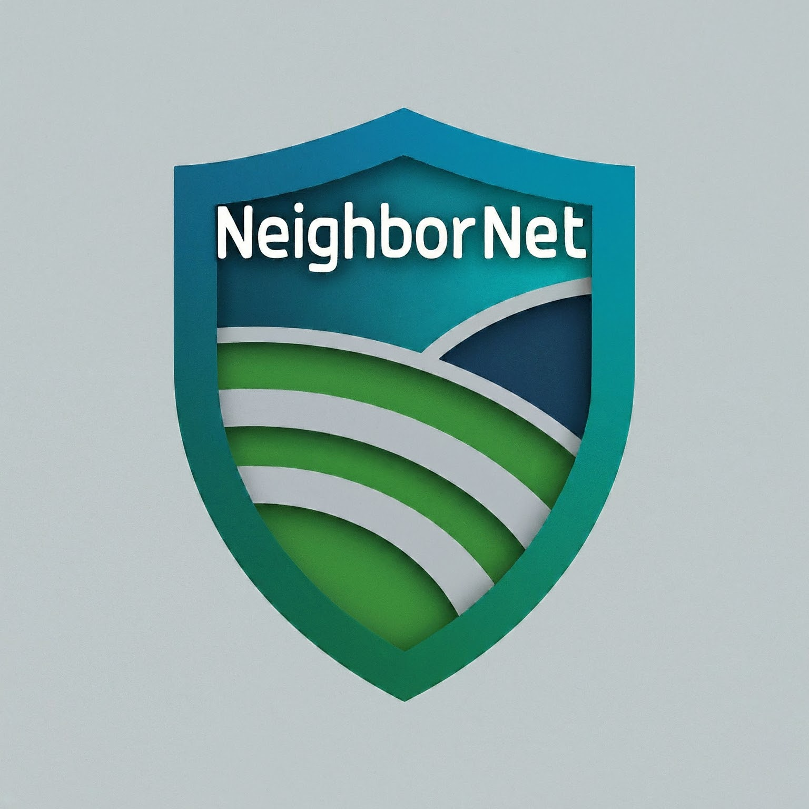

#  **NeighborNet** 

# NeighborNet

<!-- ## **Overview**    -->

Our NeighborNet project - allows a user to create an account, publish posts and events, and interact with their local community. The purpose of this project was to create a full-stack web application. We used Angular on the front-end, where HTTP requests are sent back to controllers in the Spring Boot project, where we also implemented Spring Security. 

## **Our Team**
- Kevin
- Adrian
- Justin

### **MySQL Workbench - Schema**

<!-- INSERT SCHEMA PNG -->

### **Rest Endpoints**
- **Test with Postman:**
  - https://www.postman.com/downloads/
- **AWS Deployment:**  
  - Linked Here: 
    - http://18.188.167.170:8080/NeighborNet/#/home
    - http://3.137.134.246:8080/NeighborNet
    - http://justdentondevelops.com/

### Authenticate
| HTTP Verb | URI                                         | Request Body                             | Response Body                                  | Response Codes  |
|-----------|---------------------------------------------|------------------------------------------|------------------------------------------------|-----------------|
| GET       | `/api/register`                             |                                          | Register a new user account                    | 200, 400       |
| GET       | `/api/authenticate`                         |                                          | Verify authorized user account                 | 200, 401        |

### User
| HTTP Verb | URI                                         | Request Body                             | Response Body                                  | Response Codes  |
|-----------|---------------------------------------------|------------------------------------------|------------------------------------------------|-----------------|
| GET       | `/api/user/{id}`                            |                                          | View user with specific ID                    | 200, 400       |

### Reports
| HTTP Verb | URI                                         | Request Body                             | Response Body                                  | Response Codes  |
|-----------|---------------------------------------------|------------------------------------------|------------------------------------------------|-----------------|
| GET       | `/api/reports`                              |                                          | List of all reports                            | 200             |
| GET       | `/api/reports/user`                         |                                          | List of all reports from a specific user       | 200, 404        |
| POST      | `/api/reports`                              | Representation of a new report           | Representation of the created report           | 201, 400        |
| PUT       | `/api/reports/{id}`                         | Representation of an updated report      | Representation of the updated report           | 200, 404, 400   |
| DELETE    | `/api/reports/{rid}`                        |                                          | Delete report with specific ID                 | 204, 404, 400   |
| PUT       | `/api/reports/user/{id}/disable`            |                                          | Disable report with specific ID                | 200, 404        |

### Report Tag
| HTTP Verb | URI                                         | Request Body                             | Response Body                                  | Response Codes  |
|-----------|---------------------------------------------|------------------------------------------|------------------------------------------------|-----------------|
| GET       | `/api/tags/reports/{id}`                    |                                          | View report tag with specific ID              | 200, 400       |

### Comments
| HTTP Verb | URI                                         | Request Body                             | Response Body                                  | Response Codes  |
|-----------|---------------------------------------------|------------------------------------------|------------------------------------------------|-----------------|
| GET       | `/api/comments`                             |                                          | List of all comments                           | 200             |
| GET       | `/api/comments/user`                        |                                          | List of all comments from a specific user      | 200, 404        |
| GET       | `/api/comments/report/{id}`                 |                                          | List of all comments from a specific report    | 200, 404        |
| POST      | `/api/comments/report/{reportId}`           | Representation of a new comment          | Representation of the created comment          | 201, 400        |
| PUT       | `/api/comments/{commentId}`                 | Representation of an updated comment     | Representation of the updated comment          | 200, 404, 400   |
| PUT       | `/api/comments/user/{commentId}/disable`    |                                          | Disable comment with specific ID               | 200, 404        |

<!-- ### **Methodologies Used:**
- **RESTful Design**
  - Java REST back-end:  -->

## **Technologies Used**
- **Backend:**
  - Java
  - Spring Data JPA
  - Spring Boot
  - MySQL, MySQL Workbench
  - AWS
  - git, GitHub
  - Postman
- **Frontend:**
  - Angular

## **Lessons Learned** 
- **User Authentication and Authorization**
  - Gained valuable experience in implementing user login and registration functionalities, including managing different privilege levels for CRUD operations
- **RESTful API Development**
  - Improved skills in designing and implementing RESTful APIs, including creating well-structured endpoints for managing users, reports, comments, and tags
- **Angular Frontend Development**
  - Developed a dynamic and responsive frontend using Angular, including features like data binding, form handling, and HTTP client service for API interaction
- **Version Control with Git**
  - Strengthened collaborative development skills through Git and GitHub for source control and team-based contributions
- **Git Branching**
  - Learned the importance of Git branching to ensure a smooth workflow by isolating new features from the main branch and minimizing conflicts during team collaboration

