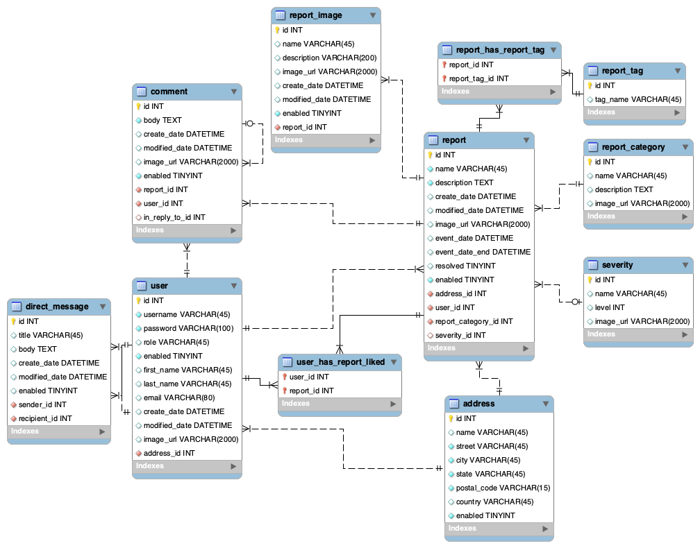

<!-- #  **Expense Tracker**  -->
<!-- Above: inserts web app logo to the left of title) -->

# NeighborNet

## **Overview**   

Our NeighborNet project - allows a user to create an account, publish posts and events, and interact with their local community.

<!-- 
The project must include:

Non-authenticated and authenticated views of data.
Login authentication to access C.R.U.D. functionality.
Full C.R.U.D. of user-generated data.
A separate privilege level that can perform C.R.U.D. on data a non-privileged user cannot. -->

## **Our Team**
- Kevin
- Adrian
- Justin

### **MySQL Workbench - Schema**

<!-- INSERT SCHEMA PNG -->

### **Rest Endpoints**
- **Test with Postman:**
  - https://www.postman.com/downloads/
- **AWS Deployment:**  
  - Linked Here: 

<!-- | HTTP Verb | URI                                         | Request Body                             | Response Body                                  | Response Codes  |
|-----------|---------------------------------------------|------------------------------------------|------------------------------------------------|-----------------|
| GET       | `/api/expenses`                             |                                          | List of all expenses                           | 200             |
| GET       | `/api/expenses/{expenseId}`                 |                                          | Representation of a specific expense           | 200, 404        |
| GET       | `/api/expenses/categories/{categoryId}`     |                                          | List of expenses for a specific category       | 200, 404        |
| GET       | `/api/expenses/payments/{paymentMethodId}`  |                                          | List of expenses for a specific payment method | 200, 404        |
| POST      | `/api/expenses`                             | Representation of a new _expense_        | Representation of the created expense          | 201, 400        |
| PUT       | `/api/expenses/{expenseId}`                 | Representation of an updated _expense_   | Representation of the updated expense          | 200, 404, 400   |
| DELETE    | `/api/expenses/{expenseId}`                 |                                          |                                                | 204, 404, 400   |
 -->

### **Methodologies Used:**
- **RESTful Design**
  - Java REST back-end: 
  

## **Technologies Used**
- **Backend:**
  - Java
  - Spring Data JPA
  - Spring Boot
  - MySQL, MySQL Workbench
  - AWS
  - git, GitHub
  - Postman
- **Frontend:**

## **Lessons Learned** 

## **Resources**

